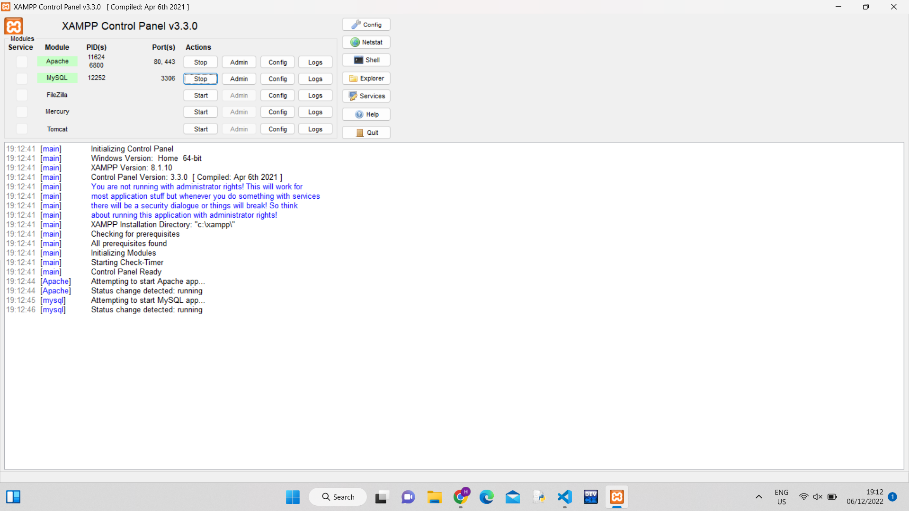
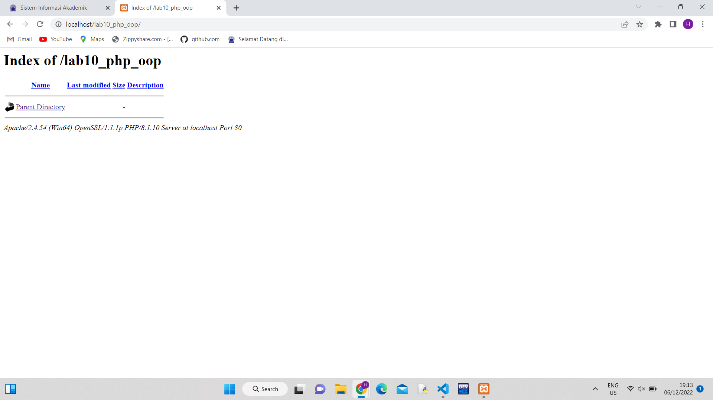
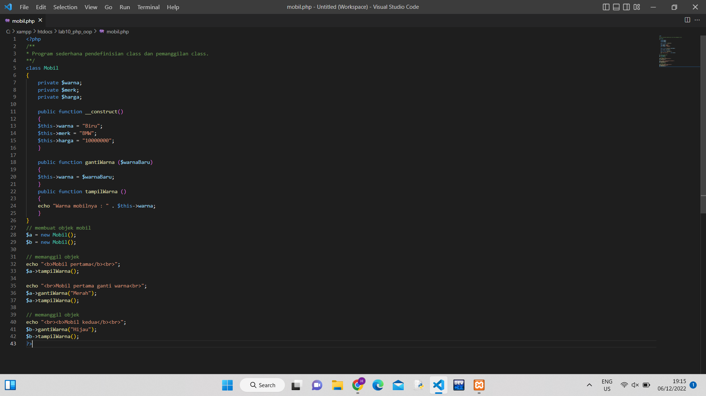
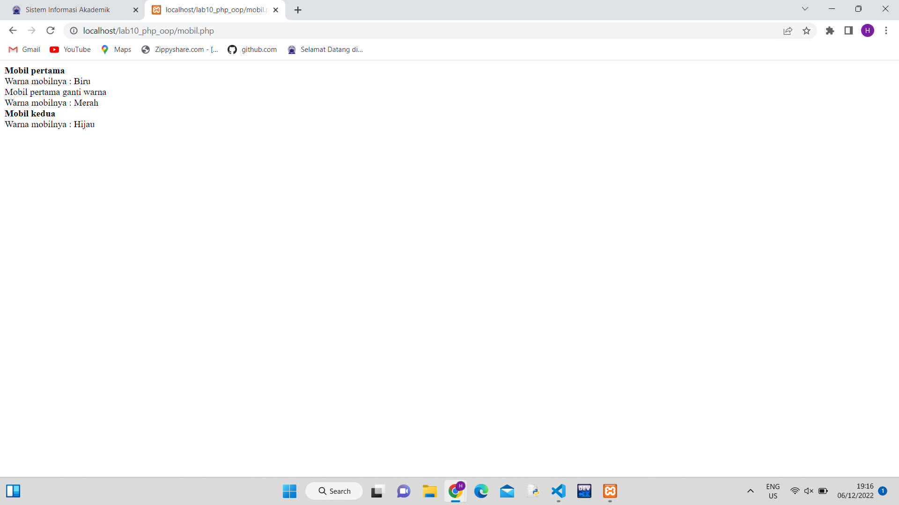
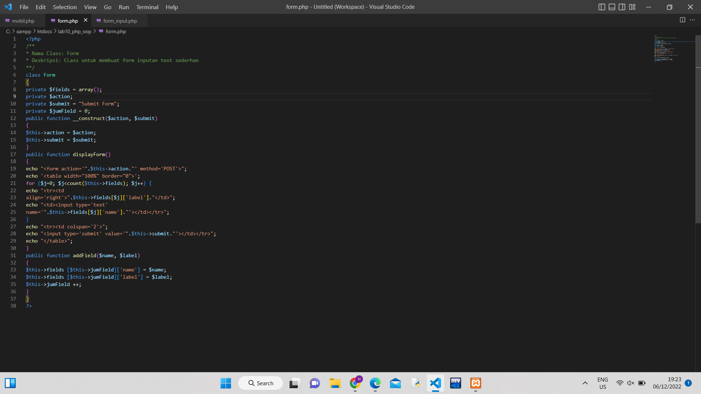
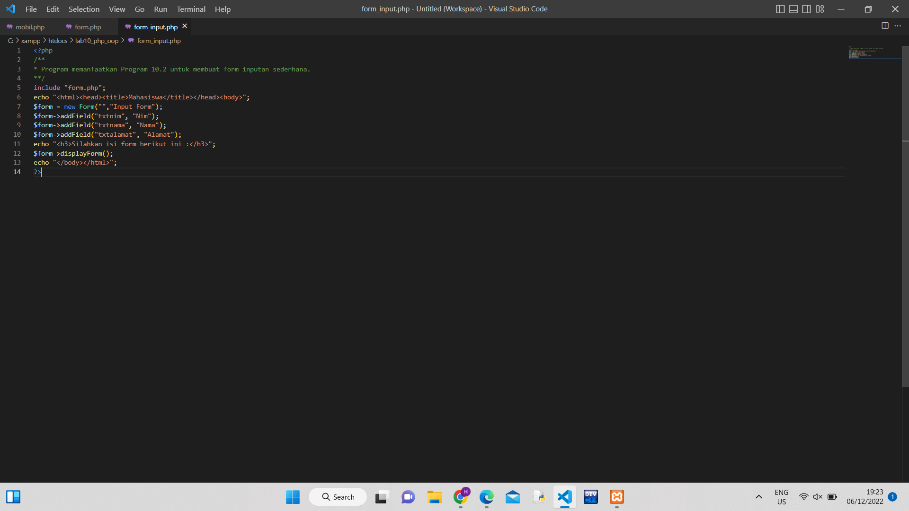
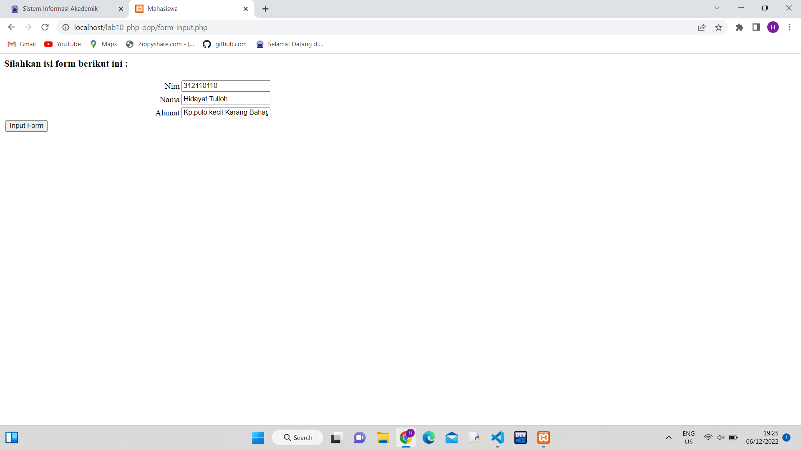

# Lab10Web_php_oop

<b>Nama	: Hidayat Tulloh
  
NIM		: 312110110
  
Kelas		: TI.21.B.1
  
Matkul		: Pemrograman Web
  
Langkah – Langkah praktikum:</b>

1.	Buka xampp terlebih dahulu kemudian start apache dan mysql

2. Buat folder baru dengan nama lab10_php_oop pada folder htdocs
 

2.	Buat file baru dengan nama mobil.php seperti berikut

 

Simpan pada folder lab10_php_oop yang telah dibuat kemudian buka pada browser dengan link http://localhost/lab10_php_oop/mobil.php 

 

3.	Buat file baru dengan nama form.php seperti berikut
 
 

4.	Buat file baru dengan nama form_input.php seperti berikut

Simpan pada folder lab10_php_oop yang telah dibuat kemudian buka pada browser dengan link http://localhost/lab10_php_oop/form_input.php 
 
